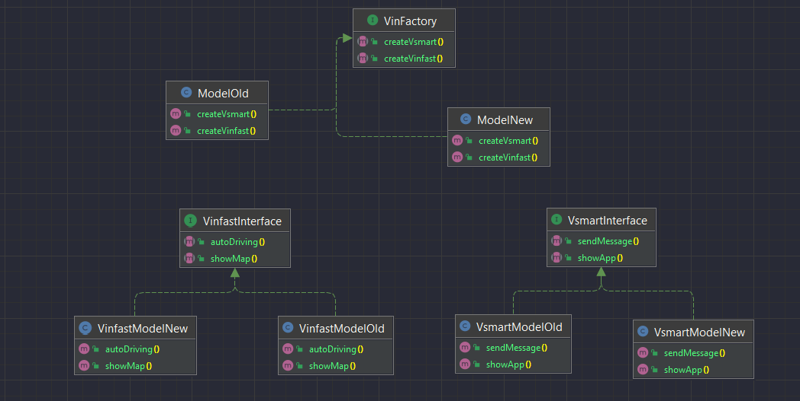

# Design_pattern

### Định nghĩa

- Design pattern là các giải pháp tổng thể đã được tối ưu hóa, được tái sử dụng cho các vấn đề phổ biến trong thiết kế phần mềm mà chúng ta thường gặp phải hàng ngày.
- Design patterns là một kỹ thuật trong lập trình hướng đối tượng, không phải là ngôn ngữ cụ thể nào cả, nó là một kĩ thuật lập trình.
- Design Pattern giúp bạn giải quyết vấn đề một cách tối ưu nhất, cung cấp cho bạn các giải pháp trong lập trình OOP.
### Công dụng 
- Tăng tốc độ phát triển phần mềm.
- Code tường minh, dễ dàng cho team work.
- Tái sử dụng code.
- Hạn chế lỗi tiềm ẩn, dễ dàng nâng cấp.
### Phân loại
*Được phân loại thành 3 nhóm theo mục đích sử dụng:*

- Nhóm Creational
- Nhóm Structural
- Nhóm Behavioral
# Chi tiết
## Creational Pattern (Nhóm khởi tạo)
### Singleton
- Nó đảm bảo một class chỉ có duy nhất một instance được khởi tạo và nó cung cấp phương thức truy cập đến instance đó từ mọi nơi (global access).
  - Sử dụng Singleton khi chúng ta muốn:
    - Đảm bảo rằng chỉ có một instance của lớp.
    - Việc quản lý việc truy cập tốt hơn vì chỉ có một thể hiện duy nhất.
    - Có thể quản lý số lượng thể hiện của một lớp trong giới hạn chỉ định.
    
***Triển khai***
- Đặt constructor là private để client không thể khởi tạo object của class.
- Tạo một biến static private là instance của class đó để đảm bảo rằng nó là duy nhất và chỉ được tạo ra trong class đó thôi.
- Tạo một public static method trả về instance vừa khởi tạo bên trên, đây là cách duy nhất để các class khác có thể truy cập vào instance của class này.

### Abstract Factory
- Cung cấp một interface cho việc khởi tạo các tập hợp của những object có đặc điểm giống nhau mà không cần quan tâm object đó là gì.

  - Abstract Factory Pattern giúp đảm bảo rằng các product mà bạn nhận được từ một factory đều tương thích với nhau.
  - Abstract Factory Pattern giúp hạn chế sự phụ thuộc giữa creator và concrete products.
  - Abstract Factory Pattern giúp gom các đoạn code tạo ra product vào một nơi trong chương trình, nhờ đó giúp dễ theo dõi và thao tác.

***Triển khai***
- Đầu tiên cần khai báo rõ ràng interface cho từng product riêng biệt theo họ của product.
Yêu cầu tất cả sản phẩm phải tuân theo interface đã khai báo.
- Khai báo Abstract Facroty interface với các phương thức tạo ra product. Các phương thức này trả về các kiểu 
abstract product.
- Đối với mỗi biến thể của 1 họ product, tạo 1 class factory riêng dựa trên Abstract Factory inerface. Factory 
là 1 class trả về các sản phẩm của 1 họ cụ thể. 

### Factory Method
- Factory Method cung cấp một interface, phương thức trong việc tạo nên một đối tượng (object) trong class. Nhưng để cho class con kế thừa của nó có thể ghi đè để chỉ rõ đối tượng (object) nào sẽ được tạo. Factory method giao việc khởi tao một đối tượng (object) cụ thế cho lớp con (subclass).
  - Tạo ra một cách khởi tạo object mới thông qua một interface chung.
  - Che giấu quá trình xử lý logic của phương thức khởi tạo.
  - Giảm sự phụ thuộc, dễ dàng mở rộng.
  - Giảm khả năng gây lỗi compile.

***Triển khai***
- Đầu tiên cần cài đặt khuôn mẫu (interface) của các đối tượng mà factory method tạo ra. 
- Tạo các class implement interface vừa cài đặt (Concreteproduct). 
- Khai báo factory method, trả về kiểu đối tượng thuộc kiểu product. 
- Gọi factory method để tạo các đối tượng trả về có kiểu là product. 
- Tạo lớp để thực hiện việc ghi đè factory method để trả về instance của Concreteproduct.

### Builder 
